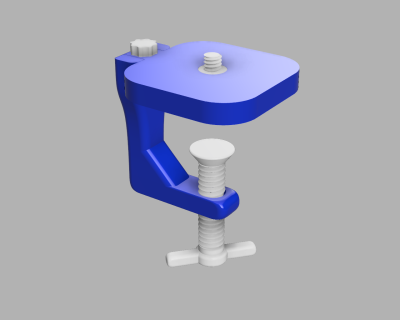
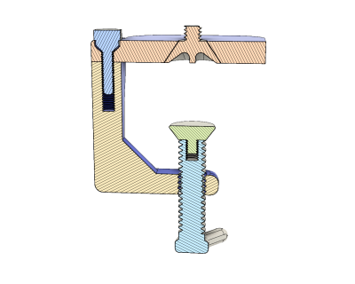
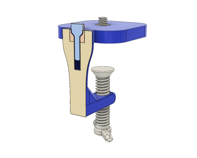

# 3D Printable Webcam Mount (11/2018)

<table>
<tr>
<td></td>
<td></td>
</tr>
<tr>
<td></td>
<td></td>
</tr>
<tr>
<td></td>
</tr>
</table>

A 3D printable webcam vise mount. Fits the standard 1/4"-20 webcam socket with a thumbscrew. The clamp height is an adjustable parameter. The clamp and base should be joined with a metal M5x20 bolt. A 3D printable one is included, but isn't recommended due to its limited strength.

**Design**: [Webcam Mount v43.f3d](Webcam%20Mount%20v43.f3d) (Fusion 360 Archive)

**Design**: https://a360.co/2PoXdD9 (A360)

**STLs**:

  * [Clamp Base Bottom.stl](stls/Clamp%20Base%20Bottom.stl)
  * [Clamp Base Top.stl](stls/Clamp%20Base%20Top.stl)
  * [Clamp Screw.stl](stls/Clamp%20Screw.stl)
  * [Clamp Screw Top.stl](stls/Clamp%20Screw%20Top.stl)
  * [Webcam Bolt.stl](stls/Webcam%20Bolt.stl)
  * [Clamp Base Bolt.stl](stls/Clamp%20Base%20Bolt.stl) (not recommended, use metal M5x20 bolt)

**Recommended Print Settings:** 0.20mm layer height, 20% infill

**License**: 
